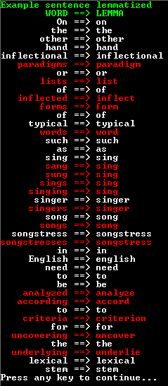

# Lemmatisation demo
I am using the lemmatisation library from: http://lemmatise.ijs.si/

## Purpose
- Help normalize words for machine learning.

## Wikipedia:
> Lemmatisation (or lemmatization) in linguistics is the process of grouping together the inflected forms of a word so they can be analysed as a single item, identified by the word's lemma, or dictionary form.

> In computational linguistics, lemmatisation is the algorithmic process of determining the lemma of a word based on its intended meaning. Unlike stemming, lemmatisation depends on correctly identifying the intended part of speech and meaning of a word in a sentence, as well as within the larger context surrounding that sentence, such as neighboring sentences or even an entire document. As a result, developing efficient lemmatisation algorithms is an open area of research.

https://en.wikipedia.org/wiki/Lemmatisation

## Preview

    

## Copyright and license
Code released under the MIT license.
